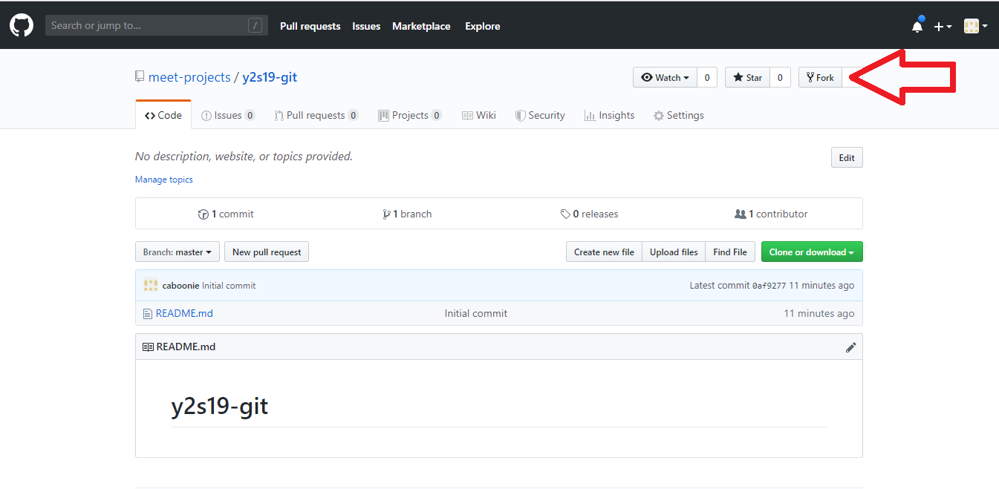
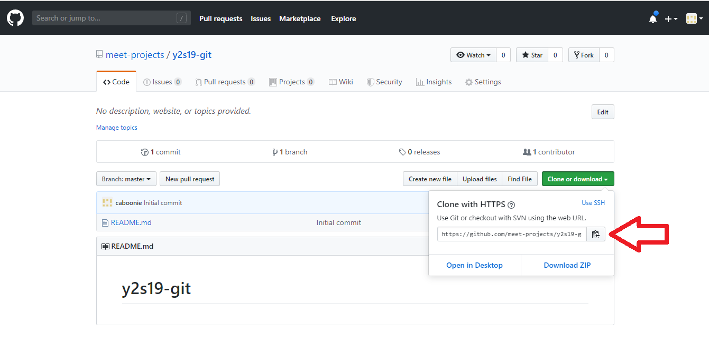
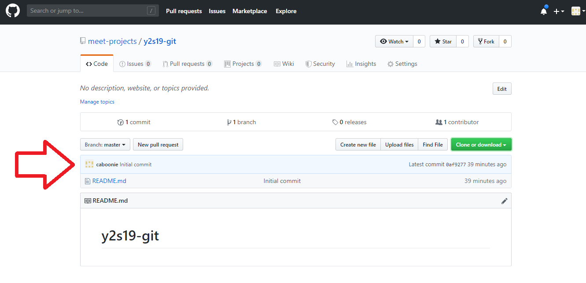
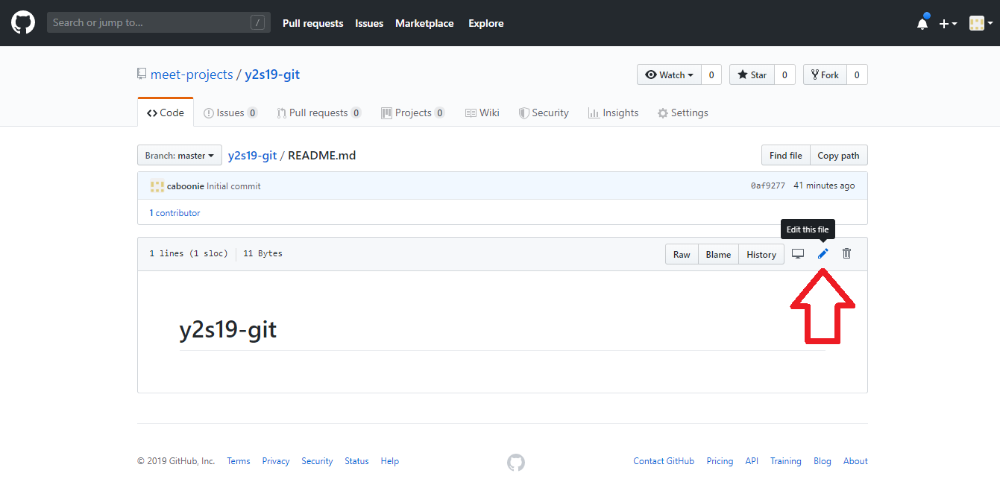

# y2s19 git lab
## Cloning a Repo
- First you'll want to fork this lab, which will make a copy of it for yourself. When you push code, you will make changes to the github repository, so you should make changes on your own code.

- Next you need to clone the repository you just forked. Copy the clone link with this button:

- Open a terminal and `cd` into wherever you want to put this lab. Then type `git clone` and paste in the link you copied.
- Find the folder you just clones using the file explorer and tell yourself you did a good job.
## Pushing Away
- Add a file to the folder. Any file you want it doesn't matter.
- Go back to the terminal and `cd` into the folder you just cloned. 
- Add the file you just changed using `git add`. Now the files are ready to commit
- Commit the changes
- Push the changes
- Go to github, open this repo and check that in the repo the file you just added is there.
## Pulling Back
- On github, click on the `README.md` file

- Click on the pencil icon

- Type something in the file and then click `Commit changes` at the bottom of the page. Now the repo has been changed, so the local copy on your computer is now out-of-date!
- To fix this, go to your terminal and type `git pull`. This will get the changes from the github repository and apply them to your local repo.
